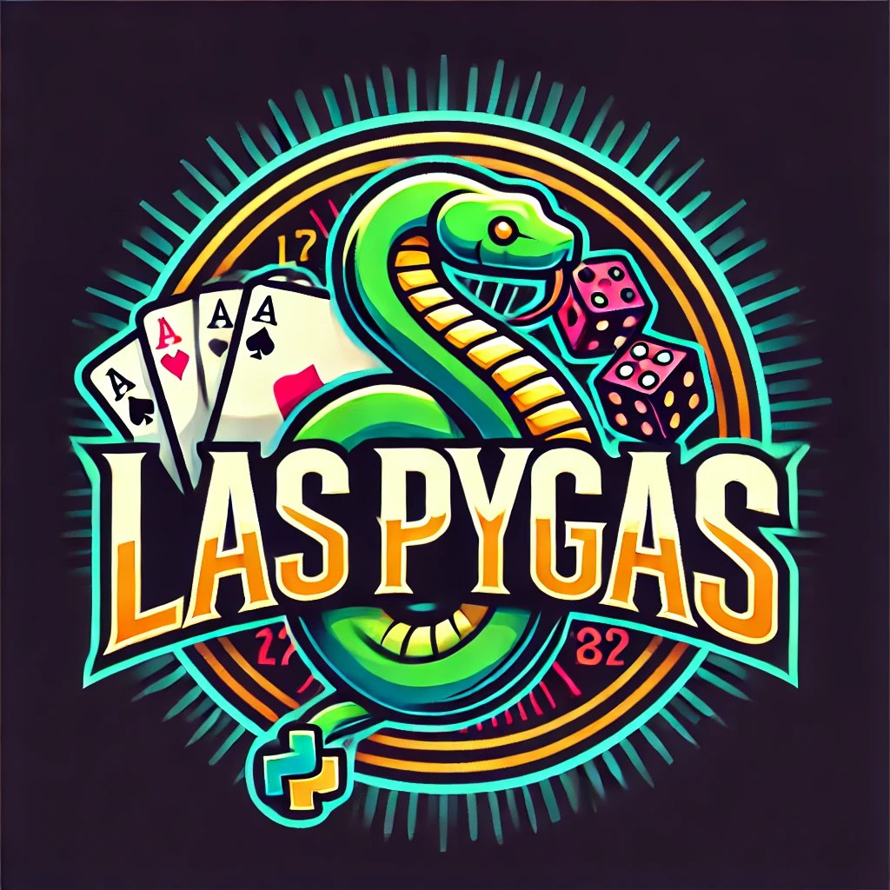

# 🎰 Las Pygas - Multiplayer Casino Platform



Многопользовательская онлайн-платформа с азартными играми в реальном времени.

## 🌟 Особенности

- 🚀 Игры в реальном времени с WebSocket
- 👥 Мультиплеерные режимы
- 💰 Система баланса и ставок
- 🔐 Безопасная аутентификация
- 📊 История игр и статистика

## 🛠 Технологии

| Категория       | Технологии                          |
|-----------------|-------------------------------------|
| Backend         | Python, Flask, Flask-SocketIO       |
| Frontend        | HTML5, CSS3, JavaScript             |
| База данных     | SQLite (SQLAlchemy ORM)             |
| Аутентификация  | Flask-Login                         |
| Асинхронность   | Eventlet                            |

## 🚀 Быстрый старт

### Предварительные требования
- Python 3.8+
- pip

### Установка

```bash
# 1. Клонировать репозиторий
git clone https://github.com/fedor-11/las_pygas.git
cd las_pygas

# 2. Создать и активировать виртуальное окружение
python -m venv .venv
source .venv/bin/activate  # Linux/MacOS
.venv\Scripts\activate     # Windows

# 3. Установить зависимости
pip install -r requirements.txt

# 4. Настроить окружение
export FLASK_APP=main.py      # Linux/MacOS
set FLASK_APP=main.py         # Windows CMD
$env:FLASK_APP="main.py"      # Windows PowerShell

# 5. Инициализировать БД
flask db init
flask db migrate -m "Initial migration"
flask db upgrade

# 6. Запустить сервер
python main.py